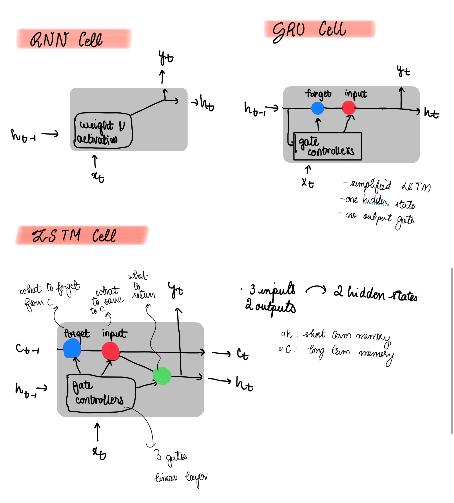

# Course Outline

1. Training Robust Neural Networks
2. Images and CNN
3. Sequences and RNN
4. Multi-input and Multi-Output Architectures

#  Training Robust Neural Networks


## PyTorch Dataset

```Python
from torch.utils.data import Dataset
import pandas as pd

class WaterDataset(Dataset):
    def  __init__(self, csv_path):
        # inherits from torch Dataset
        super().__init__()
        df = pd.read_csv(csv_path)
        self.data = df.to_numpy()

    def __len__(self):
        return self.data.shape[0]

    def __getitem__(self, idx):
        # all but last are the features, and the last one is the label
        features = self.data[idx, :-1]
        label = self.data[idx, -1]
        return features, label

```

## DataLoader Setup

```Python

from torch.utils.data import DataLoader

dataset_train = WaterDataset("water_tarin.csv")
# pass to pytroch data loader
dataloader_train = DataLoader(dataset_train, batch_size=2, shuffle=2)

# get one barch from the data loader
features,labels = next(iter(dataloader_train))
```

## Model definition

```Python
import torch.nn as nn

# Sequential (Quick but less flexible)
net_seq = nn.Sequential(
    nn.Linear(9, 16),
    nn.ReLU(),
    nn.Linear(16, 8),
    nn.ReLU(),
    nn.Linear(8, 1),
    nn.Sigmoid(),
)

# Class-based model (Preferred for customization, debugging, layers like BatchNorm)
class Net(nn.Module):
    def __init__(self):
        super().__init__()
        self.fc1 = nn.Linear(9, 16)
        self.fc2 = nn.Linear(16, 8)
        self.fc3 = nn.Linear(8, 1)

    def forward(self, x):
        x = nn.functional.relu(self.fc1(x))
        x = nn.functional.relu(self.fc2(x))
        x = nn.functional.sigmoid(self.fc3(x))
        return x

net = Net()
```

## Training Loop

Loss function - conventionally called the criterion
BCELoss - for binary classification
SGD - optimizer

```Python
import torch.optim as optim

criterion = nn.BCELoss()
optimizer = optim.SGD(net.parameters(), lr=0.01)

for epoch in range(1000):
    for features, labels in dataloader_train:
        optimizer.zero_grad()
        outputs = net(features)
        loss = criterion(outputs, labels.view(-1, 1))
        loss.backward() # gradients contain information about direction and size of the changes required to minimize the loss
        optimizer.step() # pass the gradients to the optimizer
```

How an optimizer works?
eg consider 
Parameters [1,0.5] and graidents [0.9, -0.2]
Optimizer takes these and outputs parameter updates
eg. [-0.5, 0.5], notices the positive gradient meant negative update, and a negative gradient positive update. The amount is based on the optimizer used.

SGD depends on learning rate, a predefined hyperparameter
Very simple, so rarely used in practice,
Using the same LR on a paramater cannot be optimal so **Adaptive Gradient(Adagrad)** adaps learning rate for each paramater

`optim.Adagrad(net.parameters(), lr = 0.01)`
- good for sparse data but may use decrease in lr too fast
`optim.RMSprop(net.parameters(), lr =0.01)` - update each parameter based on the size of the previous gradients
- updates based on the size of previous gradients
`optim.Adam(..)`
- most widely used
- RMSprop + gradient momentum


## Evaluation

- once model is trained evaluate on test data


```Python
from torchmetrics import Accuracy

acc = Accuracy(task="binary")
net.eval() # put in eval mode and iterate over test data batches with no gradients

with torch.no_grad():
    for features, labels in dataloader_test:
        outputs = net(features)
        preds = (outputs >= 0.5).float()
        acc(preds, labels.view(-1, 1))

accuracy = acc.compute()
print(f"Accuracy: {accuracy}")
```

-----------------------------
Optimizers Summary
-----------------------------
SGD: Simple, fast. Rare in practice.
Adagrad: Good for sparse data, fast decay
RMSProp: Handles varying gradient sizes
Adam: Best default. Combines momentum + RMSProp

Usage:
optimizer = optim.Adam(net.parameters(), lr=0.01)
 
---

## 🔻 Vanishing Gradients
- Gradient become extremely small during backward pass.
- Early layers receive **tiny weight updates**, making them learn slowly or not at all.
- Common in deep networks using **sigmoid or tanh** activations.

### 🔬 Why it happens?
For sigmoid/tanh:
- Derivatives ∈ (0, 1)
- Multiple small values → exponentially smaller gradients as layers increase.

### 🔍 Impact
- Slows convergence.
- Traps training in local minima.
- Network becomes **hard to train**.

---

## 🔺 Exploding Gradients
- Gradients grow exponentially through layers.
- Causes **numerical instability**, large parameter updates.

### 🔍 Impact
- Diverging loss.
- Model weights become **NaN or Inf**.

---

## 🔧 Solutions

### 1. ✅ Better Weight Initialization
- Goal: Maintain gradient variance across layers.
- **Xavier Initialization** (Glorot) for tanh.
- **He/Kaiming Initialization** for ReLU/ELU.

```python
import torch.nn.init as init

init.kaiming_uniform_(layer.weight, nonlinearity='relu')
```

### 2. ✅ Use Better Activation Functions
- **ReLU**: Simpler and avoids saturation in positive range.
- **Leaky ReLU / ELU / GELU**: Prevents dying neuron problems and keeps gradients flowing.

### 3. ✅ Batch Normalization
- Normalize layer outputs → keeps activation distributions stable.
- Helps mitigate both vanishing and exploding gradients.
```python
import torch.nn as nn

class Net(nn.Module):
    def __init__(self):
        super().__init__()
        self.fc1 = nn.Linear(128, 64)
        self.bn1 = nn.BatchNorm1d(64)
    def forward(self, x):
        x = self.bn1(self.fc1(x))
        return x
```

### 4. ✅ Gradient Clipping
- Limits gradient values during backprop.
```python
torch.nn.utils.clip_grad_norm_(model.parameters(), max_norm=1.0)
```

---


## Weight Initialization

When we create a torch layer, its parameters stored in the weight attribute get initialized to random values.

Good initialization ensures:
- variance of layer inputs = variance of layer outputs
- variance of gradients the same before and after a layer
- achieving this for each depens on the activtaion function

[]Find out Why

```Python
import torch.nn.init as init

# add this snippet in the initization after initializing layers as self.fcx = nn.Linear(...)

init.kaiming_uniform_(net.fc1.weight)
init.kaiming_uniform_(net.fc2.weight)
init.kaiming_uniform_(net.fc3.weight, nonlinearity="sigmoid")

# Use He initialization (kaiming) for ReLU
```

- `nn.functional.relu` is the most commonly used activation function
- suffers from dying neurons
- ELU : non zero gradients for negative values, helps against dying neurons, average output around zero- helps against vanishing gradients

## Batch Normalization

- applied after a layer where output is first normalized, making sure output distribution is normal, then scales and shifted
-  normalized outputs are not passed further; rather, they are rescaled again using learned parameters!
- model learns optimal inputs distribution for each layer
    - faster loss decrease
    - helps against unstable gradients


```Python
class Net(nn.Module):
    def __init__(self):
        super().__init__()
        self.fc1 = nn.Linear(9, 16)
        # Add two batch normalization layers
        self.bn1 = nn.BatchNorm1d(16)
        self.fc2 = nn.Linear(16, 8)
        self.bn2 = nn.BatchNorm1d(8)
        self.fc3 = nn.Linear(8, 1)
        
        init.kaiming_uniform_(self.fc1.weight)
        init.kaiming_uniform_(self.fc2.weight)
        init.kaiming_uniform_(self.fc3.weight, nonlinearity="sigmoid")
    
    def forward(self, x):
        x = self.fc1(x)
        x = self.bn1(x)
        x = nn.functional.elu(x)

        # Pass x through the second set of layers
        x = self.fc2(x)
        x = self.bn2(x)
        x = nn.functional.elu(x)

        x = nn.functional.sigmoid(self.fc3(x))
        return x

# BatchNorm reduces internal covariate shift and stabilizes gradients.
```

## Summary

- Make a dataset class using torch dataset, then set up the dataloader_train
- train by making a net class, which inherits from nn.Module, and define init and forward pass
- in init make sure to add in layers for batch normalization, and use the appropriate weight initialization method, such as kiaming for RELU to help with vanishing and exploring gradients problems
- set up the training loop by choosing the appropriate criterion/loss function and the optimizer, number of epochs.
- once trained, test the model. Remember to set `net.eval()`. Choose appropriate `Accuracy` metric. For features and labels in the testing set, making predictions, compare and get accuracy.

# Images and CNN

## Loading and Transforming Image Data
```python
from torchvision.datasets import ImageFolder
from torchvision import transforms

train_transforms = transforms.Compose([
    transforms.ToTensor(),
    transforms.Resize((128, 128))
])

# this is a pytorch dataset like the pervious WaterDataset, can create a dataLoader from it and get a dataset sample
dataset_train = ImageFolder("data/clouds_train", transform=train_transforms)
```
- **Why this way?** `ImageFolder` auto-labels data from directory names.
- `ToTensor` converts image to PyTorch format (C×H×W).
- `Resize` ensures uniform input size for CNN.

## DataLoader and Displaying Images
```python
from torch.utils.data import DataLoader
import matplotlib.pyplot as plt

dataloader_train = DataLoader(dataset_train, shuffle=True, batch_size=1)
image, label = next(iter(dataloader_train))
print(image.shape) # torch.Size([1,3,128,128]) batch size, three color channels, images height and width
image = image.squeeze().permute(1, 2, 0) # 128,128,3 
plt.imshow(image)
plt.show()
```
- `permute` reorders tensor from (C,H,W) to (H,W,C) for display.

## Data Augmentation
```python
train_transforms = transforms.Compose([
    transforms.RandomHorizontalFlip(),
    transforms.RandomRotation(45),
    transforms.ToTensor(),
    transforms.Resize((128, 128))
])
```
- **Why?** Increases dataset diversity → better generalization.

## Convolutional Layer

- Linear layers: too many parameters, increase overfitting, do not recognize spatial patterns
- convolution: compute dot product of input patch  with filter and compute the sum
- add padding to the input (zeroes)
    - maintains spatial dimensions, and ensures border pixels are treated equally to others
- at each position perform convolution resulting in a feature map
    
```python
nn.Conv2d(in_channels=3, out_channels=32, kernel_size=3, padding=1)
```
- Learns spatial features, fewer weights than linear layers.
- `padding=1` preserves input size.

## Max Pooling Layer
```python
nn.MaxPool2d(kernel_size=2)
```
- Reduces dimensionality and computation, retains strong features.
- used after convolutional layer, in each 4 by 4 grid, only take the largest values

## CNN Architecture Design

- lesser params than linear layers, 3x3 filter - 9, even if many filters, different from linear layer where everything is connected

```python
import torch.nn as nn

class Net(nn.Module):
    def __init__(self, num_classes):
        super().__init__()
        # convulution, activation, pooling, applied twice and flattened
        self.feature_extractor = nn.Sequential(
            # input image 3x64x64
            nn.Conv2d(3, 32, kernel_size=3, padding=1), # output 32 features maps, 32 64 64
            nn.ELU(),
            nn.MaxPool2d(2), # dimentions halfed, 32 32 32
            nn.Conv2d(32, 64, kernel_size=3, padding=1), # 64 32 32
            nn.ELU(),
            nn.MaxPool2d(2), # 64 16 16
            nn.Flatten()
        )
        self.classifier = nn.Linear(64*16*16, num_classes)

    def forward(self, x):
        x = self.feature_extractor(x)
        return self.classifier(x) # single linear layer
```
- Separate **feature extractor** and **classifier** is modular design.
- `Flatten` bridges CNN to fully connected layer.

## Training Loop for Classifier

What should not be augmented? eg hand written letters, eg W and M
Choose augmentation with data and task in mind
For cloud classiication, random rotation, horizontal flip, and auto contrast adjustment is good
Multiclass classification tasks, so Cross-Entropy loss

```Python
train_transforms = transforms.Compose([transforms.RandomHorizontalFlip(),
    transforms.RandomRotation(45),
    transforms.RandomAutocontrast(),
    transforms.ToTensor(),
    transforms.Resize((218, 128))
])
```
```python
import torch.optim as optim

net = Net(num_classes=7)
criterion = nn.CrossEntropyLoss()
optimizer = optim.Adam(net.parameters(), lr=0.001)

for epoch in range(10):
    for images, labels in dataloader_train:
        optimizer.zero_grad()
        outputs = net(images)
        loss = criterion(outputs, labels)
        loss.backward()
        optimizer.step()
```
- Standard training steps.
- `Adam` is robust, adaptive learning rate.

## Test Data Loader (No Augmentation)
```python
test_transforms = transforms.Compose([
    transforms.ToTensor(),
    transforms.Resize((64, 64))
])
dataset_test = ImageFolder("clouds_test", transform=test_transforms)
```

## Evaluation with Metrics
Previously predicted based on accuracy
Precisoin: Fraction of correct positive predictions, out of those predicted positive how many are actually positive, out of those you classified as having cancer how many actually have cancer, higher precision - better at avoiding false positives

Recall: fraction of all positive examples correctly predicted, out of those who have cancer, how many have you labelled as having cancer? higher recall - better at true positives

For multiclass classification
- precision: out of all those who were predicted as being cumulus clouds, how many are actually cumulus clouds? so how much can I trust you when you say something is cumulus
- recall: out of all the cumulus examples, how many were correctly predicted, how much of my data of cumulus can I expect you to correctly label?

7 cloud classes- 7 precision an recall scores
- micro average: global calculation
- macro average: mean of per-class Metrics
- weighted average: weighted mean of perclass metric

```Python
from torchmetrics import Recall

recall_per_class = Recall(task = "multiclass", num_classes=7, average=None)
recall_micro = Recall(task = "multiclass", num_classes=7, average="micro")
recall_macro = Recall(task = "multiclass", num_classes=7, average="macro")
recall_weighted = Recall(task = "multiclass", num_classes=7, average="weighted")
```
Micro: imbalanced dataset
macro: care about performance on small classes even if they have fewer datapoints
weighted: consider errors in large classes as more important

weighted: 

Evaluation loop

```python
from torchmetrics import Precision, Recall

metric_precision = Precision(task="multiclass", num_classes=7, average="macro")
metric_recall = Recall(task="multiclass", num_classes=7, average="macro")

net.eval()
with torch.no_grad():
    for images, labels in dataloader_test:
        outputs = net(images)
        _, preds = outputs.max(1)
        metric_precision(preds, labels)
        metric_recall(preds, labels)

precision = metric_precision.compute()
recall = metric_recall.compute()
```
- **Macro averaging**: treats each class equally.

## Per-Class Recall
```python
metric_recall = Recall(task="multiclass", num_classes=7, average=None)
recall = metric_recall.compute()

recall_per_class = {k: recall[v].item() for k, v in dataset_test.class_to_idx.items()}
```
- Gives insights into model weaknesses per class.

## Summary

- from torchvision get `transforms`, use `transforms.Compose` to get a sequence of transformations such as to tensor, resize, rotate, autocontrast etc, basically data augmentation based on the data
- use `ImageFolder` to make the dataset, with the given transforms
- then use DataLoader on this dataset
- for feature extracter
    - add in convlolutional layer, describing number of output features maps, kernel size, padding
    - then relu, elu etc. activation function
    - then max pool layer to reduce dimensions
    - add in more if needed
    - flatten at the exploding
- define self.classifier , maybe linear layer
- forward pass has feature extractor followed by classifier
- choose criterion (say Cross Entropy for multi class) and optimizer, similar training loop as before
- load test data and choose metrics, eg precision recall.
- you could do this per class, or micro, macro or weighted

# Chapter 3: Handling Sequences and Recurrent Models in PyTorch

## Sequential Data Concepts
- Sequential data is **ordered in time or space**, where position matters.
- Examples include: **Time Series**, **Text**, **Audio**, **Sensor data**.
- The **key idea** is that current input depends on previous ones, so learning **temporal dependencies** is crucial.
- We make sure there is no **look ahead bias**, so no random train-test split like typical applications, so split by time
- need to select **sequence length** : no of data points in one training examples, eg making a prediction every 24 hours, so if every 15 minutes of data is available, consider sequence length of 96


## Sequence Creation for Time Series
We convert time series into input-output pairs where:
- Input: last `N` steps (sequence length)
- Output: next step (target for prediction)

### Python Function
```python
def create_sequences(df, seq_length):
    xs, ys = [], []
    for i in range(len(df) - seq_length):
        x = df.iloc[i:i+seq_length, 1]
        y = df.iloc[i+seq_length, 1]
        xs.append(x)
        ys.append(y)
    return np.array(xs), np.array(ys)
```

## Using TensorDataset for PyTorch Integration
```python
from torch.utils.data import TensorDataset
import torch

dataset_train = TensorDataset(
    torch.from_numpy(X_train).float(),
    torch.from_numpy(y_train).float()
)
```
- `TensorDataset` wraps data into a structured format.
- Combines features and labels, usable with `DataLoader`.

## Building RNN Architecture

- hidden state hi and input xi are the input at each step, giving output yi and next hidden state hi+1


### RNN (Recurrent Neural Network)
- seq to vec

```python
import torch.nn as nn

class Net(nn.Module):
    def __init__(self):
        super().__init__()
        self.rnn = nn.RNN(input_size=1, hidden_size=32, num_layers=2, batch_first=True)
        self.fc = nn.Linear(32, 1)

    def forward(self, x):
        h0 = torch.zeros(2, x.size(0), 32)  # (num_layers, batch, hidden_size)
        out, _ = self.rnn(x, h0)
        return self.fc(out[:, -1, :])  # using last output timestep
```

- RNN memory cell has very short term memory so two Solutions
    - LSTM cell
    - GRU cell



- RNN not used much these days
- GRU is less computationally expensive compared to LSTM
- relative performance based on use case

## LSTM Architecture (Long Short-Term Memory)

```python
class Net(nn.Module):
    def __init__(self):
        super().__init__()
        self.lstm = nn.LSTM(input_size=1, hidden_size=32, num_layers=2, batch_first=True)
        self.fc = nn.Linear(32, 1)

    def forward(self, x):
        h0 = torch.zeros(2, x.size(0), 32)
        c0 = torch.zeros(2, x.size(0), 32)
        out, _ = self.lstm(x, (h0, c0))
        return self.fc(out[:, -1, :])
```

## GRU Architecture (Gated Recurrent Unit)
```python
class Net(nn.Module):
    def __init__(self):
        super().__init__()
        self.gru = nn.GRU(input_size=1, hidden_size=32, num_layers=2, batch_first=True)
        self.fc = nn.Linear(32, 1)

    def forward(self, x):
        h0 = torch.zeros(2, x.size(0), 32)
        out, _ = self.gru(x, h0)
        return self.fc(out[:, -1, :])
```

## Training Loop with MSE Loss

- for this example of forecasting electricity consumption, use acc to regression task

```python
import torch.optim as optim
import torch.nn as nn

criterion = nn.MSELoss()
optimizer = optim.Adam(net.parameters(), lr=0.001)

for epoch in range(num_epochs):
    for seqs, labels in dataloader_train:
        seqs = seqs.view(seqs.size(0), seqs.size(1), 1)  # (batch, seq_len, 1)
        outputs = net(seqs)
        loss = criterion(outputs, labels)
        optimizer.zero_grad()
        loss.backward()
        optimizer.step()
```

## Evaluation Loop with Metric

- RNN layers expect `(batch size, seq_length, num_features)` 
- for out example Dataloader gives you batch size, seq length, since only 1 feature
- we expand
- so need to squeeze here


```python
from torchmetrics import MeanSquaredError

mse = MeanSquaredError()
net.eval()
with torch.no_grad():
    for seqs, labels in test_loader:
        seqs = seqs.view(seqs.size(0), seqs.size(1), 1)
        outputs = net(seqs).squeeze() 
        mse(outputs, labels)

print(f"Test MSE: {mse.compute()}")
```

## Summary Table: Model Selection
| Model | Memory Retention | Complexity | Use-case Example              |
|-------|------------------|------------|-------------------------------|
| RNN   | Short            | Low        | Quick prototyping, basics     |
| LSTM  | Long             | High       | Text, Language Models         |
| GRU   | Moderate         | Medium     | Time series, faster inference |

## Best Practices Recap
- Always reshape sequences before feeding to RNN/LSTM/GRU.
- Use `.squeeze()` after output for loss compatibility.
- Prefer GRU/LSTM over RNN in real applications.
- Use `Adam` optimizer + `MSELoss()` for regression-style outputs.
- Start with GRU, then benchmark against LSTM.

# Multi Input and Multi Output Architectures

# Chapter 4: Multi-input and Multi-output Models in PyTorch

## Why Multi-input?
- Incorporating multiple types of input (e.g. image + metadata) helps model performance.
- Used in **multi-modal learning**, **metric learning**, **self-supervised learning**.

---

## Creating Two-input Dataset for Omniglot dataset

Inputs: Hand written character + what language it comes from (one hot encoding)

```python
from torch.utils.data import Dataset
from PIL import Image

class OmniglotDataset(Dataset):

# samples are tuples of 3, image, array, labels

    def __init__(self, transform, samples):
        self.transform = transform
        self.samples = samples

    def __len__(self):
        return len(self.samples)

    def __getitem__(self, idx):
        img_path, alphabet, label = self.samples[idx]
        img = Image.open(img_path).convert('L') # grayscale
        img = self.transform(img)
        return img, alphabet, label
```
- Returns 2 inputs: image and alphabet vector, plus label.

---

## Tensor Concatenation
```python
torch.cat((x_image, x_alphabet), dim=1)
```
- Used to combine feature vectors from both inputs before passing to the classifier.

---

## Two-input Architecture
```python
class Net(nn.Module):
    def __init__(self):
        super().__init__()
        self.image_layer = nn.Sequential(
            nn.Conv2d(1, 16, kernel_size=3, padding=1),
            nn.MaxPool2d(kernel_size=2),
            nn.ELU(),
            nn.Flatten(),
            nn.Linear(16*32*32, 128)
        )
        self.alphabet_layer = nn.Sequential(
            nn.Linear(30, 8),
            nn.ELU()
        )
        # num classes: 964
        self.classifier = nn.Sequential(
            nn.Linear(128 + 8, 964)
        )

    def forward(self, x_image, x_alphabet):
        x_image = self.image_layer(x_image)
        x_alphabet = self.alphabet_layer(x_alphabet)
        x = torch.cat((x_image, x_alphabet), dim=1)
        return self.classifier(x)
```

---

## Training Loop for Multi-input

```python
net = Net()
criterion = nn.CrossEntropyLoss()
optimizer = optim.SGD(net.parameters(), lr=0.01)

for epoch in range(10):
    for img, alpha, labels in dataloader_train:
        optimizer.zero_grad()
        outputs = net(img, alpha)
        loss = criterion(outputs, labels)
        loss.backward()
        optimizer.step()
```

---

## Why Multi-output?
- One model predicting multiple targets.
- **Multi-task learning**, **Multi-label classification**, **Built-in regularization**.

---

## Two-Outupt dataset

```python 
from torch.utils.data import Dataset
from PIL import Image

class OmniglotDataset(Dataset):
    def __init__(self, transform, samples):
        self.transform = transform
        self.samples = samples

    def __len__(self):
        return len(self.samples)

    def __getitem__(self, idx):
        # Each sample contains: (image_path, alphabet_label, character_label)
        img_path, alphabet_label, character_label = self.samples[idx]
        img = Image.open(img_path).convert('L')  # Convert to grayscale
        img = self.transform(img)
        return img, alphabet_label, character_label
```
---

## Two-output Architecture
```python
class Net(nn.Module):
    def __init__(self, num_alpha, num_char):
        super().__init__()
        self.image_layer = nn.Sequential(
            nn.Conv2d(1, 16, kernel_size=3, padding=1),
            nn.MaxPool2d(kernel_size=2),
            nn.ELU(),
            nn.Flatten(),
            nn.Linear(16*32*32, 128)
        )
        self.classifier_alpha = nn.Linear(128, num_alpha)
        self.classifier_char = nn.Linear(128, num_char)

    def forward(self, x):
        x_image = self.image_layer(x)
        output_alpha = self.classifier_alpha(x_image)
        output_char = self.classifier_char(x_image)
        return output_alpha, output_char
```

---

## Multi-output Training Loop

```python
for epoch in range(10):
    for images, labels_alpha, labels_char in dataloader_train:
        optimizer.zero_grad()
        outputs_alpha, outputs_char = net(images)
        loss_alpha = criterion(outputs_alpha, labels_alpha)
        loss_char = criterion(outputs_char, labels_char)
        loss = loss_alpha + loss_char
        loss.backward()
        optimizer.step()
```

---

## Evaluation of Multi-output Models
```python
acc_alpha = Accuracy(task="multiclass", num_classes=30)
acc_char = Accuracy(task="multiclass", num_classes=964)

net.eval()
with torch.no_grad():
    for images, labels_alpha, labels_char in dataloader_test:
        out_alpha, out_char = net(images)
        _, pred_alpha = torch.max(out_alpha, 1)
        _, pred_char = torch.max(out_char, 1)
        acc_alpha(pred_alpha, labels_alpha)
        acc_char(pred_char, labels_char)

print(f"Alphabet: {acc_alpha.compute()}")
print(f"Character: {acc_char.compute()}")
```

---

## Weighted Loss for Unequal Importance
```python
# Case 1: Hard coded weight
loss = loss_alpha + loss_char * 2

# Case 2: Weight sum to 1
loss = 0.33 * loss_alpha + 0.67 * loss_char
```

---

## When Losses are on Different Scales
```python
loss_price = loss_price / torch.max(loss_price)
loss_quality = loss_quality / torch.max(loss_quality)
loss = 0.7 * loss_price + 0.3 * loss_quality
```
- Normalize before combining if losses use different units (e.g., MSE + CrossEntropy).

---

## Summary
- Multi-input networks handle different input types (images, metadata).
- Multi-output networks allow for simultaneous prediction of multiple targets.
- Concatenate processed features before classification.
- Balance loss importance with weights or normalization.

