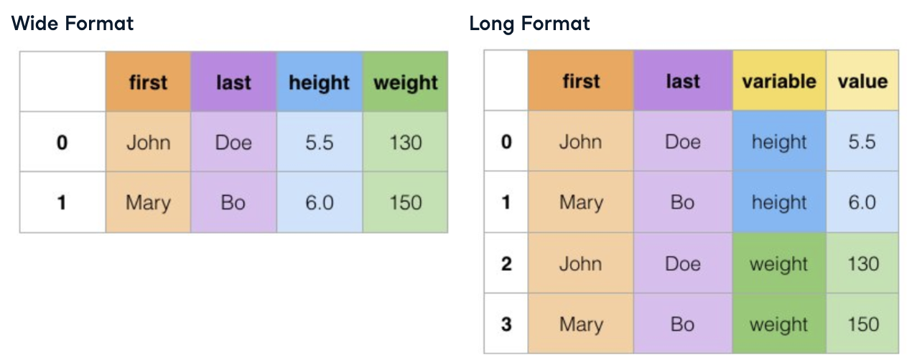

## Ch1. Data Merging
### Inner Join

```python
wards_consensus = wards.merge(cencus, on = 'ward')
# pass in the column name,index, ward then wards df columns appear first

```

Inner join: only returns rows that have matching values in both 
Columns might be like address_x, address_y since these columns are there in both the df 
Can change suffixes

```python
wards_consensus = wards.merge(cencus, on = 'ward',suffixes = ('_ward','_cen'))
```
### One to many relationships

Every row in the left table is related to one or more rows in the right table

eg wards table to businesses table

### Merging multiple Dataframes

```python
grants_licenses_ward = grants.merge(licenses, on = ["address","zip"])\ 
            .marge(wards, on = 'ward', suffixes = ('_bus','_ward'))
```

if duplicate values := all possible combinations included


## Ch 2

### Left Join

Returns all rows from left table and from right where its matching

```python

movies_taglines = movies.merge(taglines, on = 'id', how = 'left') 
# NaN if no row from right matches
```
No of rows >= left table (= on one one) 

### Other joins

- Right join: all those of the right table, mirror opposite of a left join

    ```python
    tv_moves = movies.merge(tv_genre, how = 'right', left_on = 'id', right_on = 'movie_id')
    ```
    Use left_on and right_on to tell which key columns to merge on

- Outer join

    Returns all the rows from both tables regardless of a 
    match

### Merging a table to itself

Like merging two properties of the same table

```python
original_sequels = sequels.merge(sequels, left_on = 'sequel', right_on='id',suffixes = ('_org', '_seq'))
```

Can merge with other types of joins as well using `how`

### Merging on indexes

```python
movies = pd.read_csv('tmdb_movies.csv', index_col = ['id'])
```
Pass in all the columns that are indices

on = [...] You can pass in multiple column names

```python
...(...left_index = True...right_index = True)
```

### Filtering joins

Pandas doesn't provide direct support for filtering joins, but we will learn how to replicate them.

- Mutating joins
    comined data on matching observations

- Filtering joins
    Filter observations from table based on whether or not they match an observation in another table

1. Semi Join

- filters the left table down to those observations that have a match in the right table
- Returns the intersection, similar to an inner join
- Return only columns from the left table and not the right
- no duplicate rows from the left table are returned, even if there is a one to many relationships

```python
genres_tracks = genres.merge(top_tracks, on = 'gid') # step 1
top_genres = genres[genres['gid'].isin(genres_tracks['gid'])] # step 2, subset
```
2. Anti Join

- Returns the left table excluding the intersection
- Returns only columns from left table and not the right

```python
genres_tracks = genres.merge(top_tracks, on = 'gid', how = 'left', indicator = True)
gid_list = genres_tracks.loc[genres_tracks['_merge'] == 'left_only', 'gid']
non_top_genres = genres[genres['gid'].isin(gid_list)]
```
The merge method adds a column '_merge' to the output, tells the source of each row, eg. both, left_only 

### Concatenate Dataframes together vertically

- use .concat() method with `axis = 0` for vertical concatenation

- `pd.concat([df1, df2,..])` 0 is the default
- each tables index value is retained if you dont set `ignore_index = False`
- `keys = [...]` to associate each piece of our three original tables
- `sort = True` to sort the column names in alphabetical order
- `join = 'inner'` so that you are only left with columns the tables have in common

### Verify integrity

```python
df.merge(df2, on = "col", validate = "one_to_one")
```
will raise error if one one merge is not possible, can also have one_to_many, many_to_one , many_to_many

`validate=None` by default

```python
.concat([],verify_integrity = False)
```
check for duplicates, only checks index values and not columns
raise value error on overlapping indices

### Using merge_ordered()

`.merge()` method:
- colums to join on `on, left_on, right_on`
- `how` : default inner

`pd.merge_ordered(df1, df2)`:
- same, how default outer

```python
pd.merge_ordered(aapl, mcd, on=  'date', suffixes = ('_aapl','_mcd'))
```

Can forward fill, filles missing with previous value

`fill_method = 'ffill'`

if there is no previous row, will still be NaN

use when:
when working with ordered or time series data
filling in missing values

### merge_asof()

- similar to merge_ordered() left join

`direction = 'forward'`
- data sample froma process
- time won't exactly match

### .query()

- provide a string in '', similar to the where clause in sql
- can use and, or, > < etc

### reshaping data with .melt()

- wide to long format
- wide is easier for people, long is more accessible for computer to work with
- unpivot the format of our dataset



```python
unpivoted_df = df.melt(id_vars = ['cols'], value_vars = [cols], var_name = 'instead of variable', value_name = '')
```

id_vars : colums to be used as identifier, won't change from original dataset
this will create a variable and value column, so each feature eg 2019, 2018, will come under variable
value_vars: control columns that are unpivoted so rest of the data is lost, order of output is kept