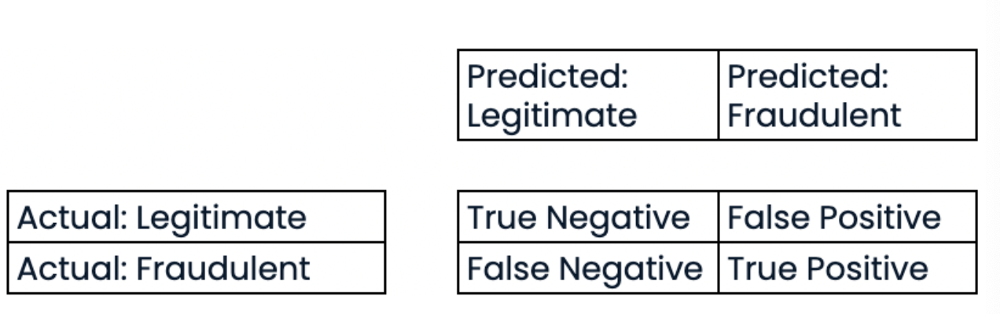

# Supervised Learning with Scikit-Learn  (Implementation in Sklearn only, not the theory)

## classification

KNN is popular for classification


```python
from sklearn.neigbours import KNeighborsClassifier
knn = KNeighborsClassifier(n_neighbors=6)
X = df[[cols]].values # use .values to convert to numpy array
y = df['target'].values
knn.fit(X, y)
prediction = knn.predict(X_new)
print('Prediction: {}'.format(prediction))
```

Measuring Model Performance


Accuracy : correct predictions / total number of data points

Split data into training and test set, train the model on training set and test on test set

```python
from sklearn.model_selection import train_test_split
X_train, X_test, y_train, y_test = train_test_split(X, y, test_size=0.3, random_state=21, stratify=y) # stratify=y to ensure that the proportion of classes in the test set is the same as the proportion of classes in the training set

knn = KNeighborsClassifier(n_neighbors=8)
knn.fit(X_train, y_train)
y_pred = knn.predict(X_test)
print('Test set predictions: {}'.format(y_pred))
knn.score(X_test, y_test)
```
Large k = less complex model = can cause underfitting
Small k = more complex model = can cause overfitting

```python
train_accuracies= {}
test_accuracies = {}
neighbors = np.arange(1, 26)

for neighbour in neighbours:
    knn = KNeighborsClassifier(n_neighbors=neighbour)
    knn.fit(X_train, y_train)
    train_accuracies[neighbour] = knn.score(X_train, y_train)
    test_accuracies[neighbour] = knn.score(X_test, y_test)

# Plotting
plt.figure(figsize = (8,6))
plt.title('k-NN: Varying Number of Neighbors')
plt.plot(neighbors, train_accuracies, label = 'Training Accuracy')
plt.plot(neighbors, test_accuracies, label = 'Testing Accuracy')
plt.legend()
plt.xlabel('Number of Neighbors')
plt.ylabel('Accuracy')
plt.show()
```

## Regression

```python
import numpy as np

# Create X from the radio column's values
X = sales_df["radio"].values

# Create y from the sales column's values
y = sales_df["sales"].values

# Reshape X
X = X.reshape(-1,1)

# Check the shape of the features and targets
print(X.shape, y.shape)
```

```python
from sklearn.linear_model import LinearRegression
lr = LinearRegression() 
lr.fit(X, y)
y_pred = lr.predict(X)
```

```python
from matplotlib import pyplot as plt
plt.scatter(X, y)
plt.plot(X, y_pred, color='red') # plot the regression line
plt.show()
```
OLS: Ordinary Least Squares, minimize the sum of the squared residuals

Default metric: R^2, the coefficient of determination, the proportion of the variance in the dependent variable that is predictable from the independent variable(s)

Range of values: 0 to 1, 1 indices explains all the variance, 0 indicates that the model explains none of the variance

Another metric: Mean Squared Error (MSE), the average of the squares of the errors or deviations


```python
# Import mean_squared_error
from sklearn.metrics import mean_squared_error

# Compute R-squared
r_squared = reg.score(X_test, y_test)

# Compute RMSE
rmse = mean_squared_error(y_test, y_pred, squared=False)

# Print the metrics
print("R^2: {}".format(r_squared))
print("RMSE: {}".format(rmse))
```

R^2 is a measure of how well the model fits the data, RMSE is a measure of the error in the model
R^2 is dependent on the way we split up the data
Not representative of the model's ability to generalize to new data

### Cross validation

5-fold cv:
say 5 folds, we split the dataset into 5 folds, first iteration we set aside the first set as test set, and remaining 4 sa the training set, we then fit on training set, make the predictions, and calcuate the metric of interest (R^2, RMSE), we then move to the next iteration and set aside the second set as test set and remaining 4 as training set, and so on

This helps combat what was a random split

k-fold cv: k is the number of folds

Tradeoff: using more folds is more computationally expensive

To implement a k-fold cv, we use the cross_val_score function

KFold allows us to set a seed and shuffle our data

```python
from sklearn.model_selection import cross_val_score, KFold
kf = KFold(n_splits=5, shuffle=True, random_state=42)
reg = LinearRegression()
cv_results = cross_val_score(reg, X, y, cv=kf, scoring='r2') # cv is the number of folds
print(cv_results)
print(np.mean(cv_results), np.std(cv_results))
print(np.quantile(cv_results, [0.025, 0.975])) # 95% confidence interval, list contains the upper and lower bounds
```

This returns an array of length number of folds


### Regularization

When minimizing the loss function, we might choose a and b too large, which can lead to overfitting

Ridge Regression:
- L2 regularization
- Add alpha * sum of squares of coefficients to the loss function
- Alpha here is like choosing the k in k-NN
- It penalizes large coefficients helping with overfitting
- hyperparameter: variable used to optimize model parameters


```python
from sklearn.linear_model import Ridge
scores = []
for alpha in [0, 0.1, 1, 10, 100]:
    ridge = Ridge(alpha=alpha, normalize=True)
    ridge.fit(X_train, y_train)
    y_pred = ridge.predict(X_test)
    scores.append(ridge.score(X_test, y_test))
```

Lasso Regression:
- L1 regularization
- Add alpha * sum of absolute values of coefficients to the loss function
- Can be used to select important features of a dataset

```python
from sklearn.linear_model import Lasso
scores = []
for alpha in [0, 0.1, 1, 10, 100]:
    lasso = Lasso(alpha=alpha, normalize=True)
    lasso.fit(X_train, y_train)
    y_pred = lasso.predict(X_test)
    scores.append(lasso.score(X_test, y_test))
```

- shrinks the coefficients of less important features to 0

Lasso for feature selection in scikit-learn

```python
from sklearn.linear_model import Lasso
lasso = Lasso(alpha=0.1, normalize=True)
X = df.drop('target', axis=1).values
y = df['target'].values
feature_names = df.drop('target', axis=1).columns
lasso.fit(X, y)
lasso_coef = lasso.coef_
plt.bar(feature_names, lasso_coef)
plt.xticks(rotation=60)
plt.show()
```

## How good is your model?

### Classification metrics

Accuracy isn't always useful. Imagine a banking fraud detection model, where 99% of the transactions are not fraudulent. A model that predicts all transactions as not fraudulent will have an accuracy of 99%, but it's not useful

Confusion matrix:



Class of interest is the positive class

Positive class: illegitimate transaction

Accuracy = (TP + TN) / (TP + TN + FP + FN)

Precision = TP / (TP + FP) = Positive predictive values
Number of correctly labeled fraudulent / labelled as fraudulent
high precision: low false positive rate, not many legitimate transactions are predicted as fraudulent

Recall = TP / (TP + FN) = Sensitivity, True positive rate
Out of all the fraudulent transactions, how many were predicted as fraudulent

high recall: lower false negative rate, most fraudulent transactions are predicted corretly, since lesser false negatives


F1 score = 2 * (precision * recall) / (precision + recall)
Harmonic mean of precision and recall

Favours models with similar precision and recall


```python   
from sklearn.metrics import classification_report, confusion_matrix
knn = KNeighborsClassifier(n_neighbors=8)
X_train, X_test, y_train, y_test = train_test_split(X, y, test_size=0.4, random_state=42)
knn.fit(X_train, y_train)
y_pred = knn.predict(X_test)

print(confusion_matrix(y_test, y_pred))
print(classification_report(y_test, y_pred))
```

Logistic Regression is used for binary classification unlike what the name suggests. It gives you a probability of the positive class

```python
from sklearn.linear_model import LogisticRegression
logreg = LogisticRegression()
X_train, X_test, y_train, y_test = train_test_split(X, y, test_size=0.4, random_state=42)
logreg.fit(X_train, y_train)
y_pred = logreg.predict(X_test)
y_pred_prob = logreg.predict_proba(X_test)[:,1]
```

by default logistic regression threshold is 0.5, if the probability is greater than 0.5, it is classified as the positive class

ROC curve: Receiver Operating Characteristic curve

Visualize how different thresholds affect true positive and false positive rates

dotted line represents a chance model, a model that randomly guesses the class

Area under the curve (AUC) is a metric to compare ROC curves

```python   
from sklearn.metrics import roc_curve
y_pred_prob = logreg.predict_proba(X_test)[:,1]
fpr, tpr, thresholds = roc_curve(y_test, y_pred_prob)
plt.plot([0, 1], [0, 1], 'k--')
plt.plot(fpr, tpr)
plt.xlabel('False Positive Rate')
plt.ylabel('True Positive Rate')
plt.title('Logistic Regression ROC Curve')      
```
ROC AUC: scores range from 0 to 1, 1 indicates a perfect model

```python   
from sklearn.metrics import roc_auc_score
print(roc_auc_score(y_test, y_pred_prob))
```

### Hyperparameter tuning

- the alpha in ridge and lasso regression, the k in k-NN are hyperparameters
- hyperparameters are not learned from the data, they are set by the data scientist
- notice how we set them before fitting the data
- try a bunch of values, fit, predict, and see how well the model performs
- to avoid overfitting on the test set, use cross validation
- one approach: GridSearchCV, searches for the best hyperparameters

- for KNN, we can search across two hyper parameters, the type of metrics and the number of neighbours are hyperparameters

```python   
from sklearn.model_selection import GridSearchCV
kf = KFold(n_splits=5, shuffle=True, random_state=42)
param_grid = {'n_neighbors': np.arange(0.0001, 1, 0.10), "solver" :["sag", "lsqr"]}
ridge = Ridge()
ridge_cv = GridSearchCV(ridge, param_grid, cv=kf)
# returns a grid search object which we can then fit to the training data
ridge_cv.fit(X_train, y_train)

# hyperparameters that perform the best, and the mean cross validation score over that fold
print(ridge_cv.best_params_, ridge_cv.best_score_)
```

#fits = # of folds * # of hyperparameters * # number of values

Doesn't scale well,

RandomizedSearchCV: searches a subset of the hyperparameters

```python
from sklearn.model_selection import RandomizedSearchCV
kf = KFold(n_splits=5, shuffle=True, random_state=42)
param_grid = {'n_neighbors': np.arange(0.0001, 1, 10), "solver" :["sag", "lsqr"]}
ridge = Ridge()
ridge_cv = RandomizedSearchCV(ridge, param_grid, cv=kf, n_iter=2)
ridge_cv.fit(X_train, y_train)

# evaluate on the test set

test_score = ridge_cv.score(X_test, y_test)

```

n_iter: number of hyperparameters to try

snippets:

```python
# Create the parameter space
params = {"penalty": ["l1", "l2"],
         "tol": np.linspace(0.0001, 1.0, 50),
         "C": np.linspace(0.1, 1.0, 50),
         "class_weight": ["balanced", {0:0.8, 1:0.2}]}

# Instantiate the RandomizedSearchCV object
logreg_cv = RandomizedSearchCV(logreg, params, cv=kf)

# Fit the data to the model
logreg_cv.fit(X_train, y_train)

# Print the tuned parameters and score
print("Tuned Logistic Regression Parameters: {}".format(logreg_cv.best_params_))
print("Tuned Logistic Regression Best Accuracy Score: {}".format(logreg_cv.best_score_))
```

## Preprocessing your data

Scikit learn needs numerical data without missing values. 
For categorical data, we can use one hot encoding, make a column for each category and assign a 1 or 0 (if you have n categories, you need n-1 columns, if you have n columns, that is redundant data and can cause mistakes). Assigning a number to each category is also not a good idea, as it implies an order

either use pandas get_dummies or scikit learn's OneHotEncoder

```python
# Create music_dummies
music_dummies = pd.get_dummies(data = music_df, columns = ['genre'], drop_first = True)

# Print the new DataFrame's shape
print("Shape of music_dummies: {}".format(music_dummies.shape))
```

```python
from sklearn.linear_model import Ridge
from sklearn.model_selection import cross_val_score
import numpy as np

# Create X and y
X = music_dummies.drop('popularity', axis=1)
y = music_dummies['popularity']

# Instantiate a ridge model
ridge = Ridge(alpha=0.2)

# Perform cross-validation
scores = cross_val_score(ridge, X, y, cv=kf, scoring="neg_mean_squared_error")

# Calculate RMSE
rmse = np.sqrt(-scores)  # Take the square root of the absolute (positive) errors
print("Average RMSE: {:.3f}".format(np.mean(rmse)))
print("Standard Deviation of the target array: {:.3f}".format(np.std(y)))
```

### Missing data

```python
df.isna().sum().sort_values(ascending=False)
```

Less than 5% missing data: drop the rows    

More than 5% missing data: drop the column

```python   
df.dropna(subset=['col1', 'col2'], inplace=True)
```

if there are missing values in the target column, drop the rows

Another option is to impute missing data

mean, median, more frequent for categorical data
- must split our data first to avoid data leakage

```python
from sklearn.impute import SimpleImputer
# split into categorical and numerical columns
# call .values and .reshape
# split into train and test
imp_cat = SimpleImputer(strategy='most_frequent')
X_train_cat = imp_cat.fit_transform(X_train_cat)
X_test_cat = imp_cat.transform(X_test_cat)

imp_num = SimpleImputer(strategy='mean')
X_train_num = imp_num.fit_transform(X_train_num)
X_test_num = imp_num.transform(X_test_num)
X_train = np.append(X_train_num, X_train_cat, axis=1)
X_test = np.append(X_test_num, X_test_cat, axis=1)
```
Imputer are known as transformers
Can impute with a pipeline

```python
from sklearn.pipeline import Pipeline
...
steps = [('imputation', SimpleImputer(strategy='mean')), ('logistic_regression', LogisticRegression())]
pipeline = Pipeline(steps)
# fit, score etc
```

In a pipeline each step but the last must be a transformer

snippets
```python
# Print missing values for each column
print(music_df.isna().sum().sort_values())

# Remove values where less than 5% are missing
music_df = music_df.dropna(subset=["genre", "popularity", "loudness", "liveness", "tempo"])

# Convert genre to a binary feature
music_df["genre"] = np.where(music_df["genre"] == "Rock", 1, 0)

print(music_df.isna().sum().sort_values())
print("Shape of the `music_df`: {}".format(music_df.shape))

# Import modules
from sklearn.impute import SimpleImputer
from sklearn.pipeline import Pipeline

# Instantiate an imputer
imputer = SimpleImputer()

# Instantiate a knn model
knn = KNeighborsClassifier(n_neighbors = 3)

# Build steps for the pipeline
steps = [("imputer", imputer), 
         ("knn", knn)]

steps = [("imputer", imp_mean),
        ("knn", knn)]

# Create the pipeline
pipeline = Pipeline(steps)

# Fit the pipeline to the training data
pipeline.fit(X_train, y_train)

# Make predictions on the test set
y_pred = pipeline.predict(X_test)

# Print the confusion matrix
print(confusion_matrix(y_test, y_pred))
```

### Centering and Scaling our data

```python
df[[cols]].describe()
```

Most machine learning models use distance to inform them. If you have features that are on larger scales, they can disproportionately influence the model

eg. KNN uses distance explicity

- can Standardize the data, subtract the mean and divide by the standard deviation
- can normalize the data, subtract the minimum and divide by the range, value between -1 and 1

```python
from sklearn.preprocessing import StandardScaler
X  = df.drop('target', axis=1).values
y = df['target'].values
X_train, X_test, y_train, y_test = train_test_split(X, y, test_size=0.3, random_state=42) # to avoid data leakage
scaler = StandardScaler()
X_train = scaler.fit_transform(X_train)
X_test = scaler.transform(X_test)
```

in Pipeline add `('scaler', StandardScaler())` after the imputer


CV and scaling in a pipeline
    
```python 

from sklearn.model_selection import GridSearchCV
from sklearn.preprocessing import StandardScaler
from sklearn.pipeline import Pipeline

steps = [('scaler', StandardScaler()), ('knn', KNeighborsClassifier())]
pipeline = Pipeline(steps)

parameters = {'knn__n_neighbors': np.arange(1, 50)}
X_tarin, X_test, y_train, y_test = train_test_split(X, y, test_size=0.3, random_state=42)
cv = GridSearchCV(pipeline, param_grid=parameters)
...
cv.best_score_
cv.best_params_
```
### Evaluating multiple models

- Size of dataset 
    - fewer features -> simpler models
    - some models like nn require large amounts of data to perform well
- Interpretability
    - some models are easier to explain, which can be important for stakeholders
- Flexibility
    - some models are more flexible and can capture more complex patterns


- Regression models can be evaluated using RMSE or R-Squared
- Classification models can be evaluated on Accuracy, Confusion matrix, precision,recall, f1 score, ROC curve, AUC

- scale data before evaluating models

```python

models = {"Linear Regression": LinearRegression(), "Ridge": Ridge(alpha=0.1), "Lasso": Lasso(alpha=0.1)}
results = []

# Loop through the models' values
for model in models.values():
  kf = KFold(n_splits=6, random_state=42, shuffle=True)
  
  # Perform cross-validation
  cv_scores = cross_val_score(model, X_train, y_train, cv=kf)
  
  # Append the results
  results.append(cv_scores)

# Create a box plot of the results
plt.boxplot(results, labels=models.keys())
plt.show()

# Import mean_squared_error
from sklearn.metrics import mean_squared_error

for name, model in models.items():
  
  # Fit the model to the training data
  model.fit(X_train_scaled, y_train)
  
  # Make predictions on the test set
  y_pred = model.predict(X_test_scaled)
  
  # Calculate the test_rmse
  test_rmse = mean_squared_error(y_test, y_pred, squared=False)
  print("{} Test Set RMSE: {}".format(name, test_rmse))

```

```python
# Create models dictionary
models = {"Logistic Regression": LogisticRegression(), "KNN": KNeighborsClassifier(), "Decision Tree Classifier": DecisionTreeClassifier()}
results = []

# Loop through the models' values
for model in models.values():
  
  # Instantiate a KFold object
  kf = KFold(n_splits=6, random_state=12, shuffle=True)
  
  # Perform cross-validation
  cv_results = cross_val_score(model, X_train_scaled, y_train, cv=kf)
  results.append(cv_results)
plt.boxplot(results, labels=models.keys())
plt.show()
```

```python
# Create steps
steps = [("imp_mean", SimpleImputer()), 
         ("scaler", StandardScaler()), 
         ("logreg", LogisticRegression())]

# Set up pipeline
pipeline = Pipeline(steps)
params = {"logreg__solver": ["newton-cg", "saga", "lbfgs"],
         "logreg__C": np.linspace(0.001, 1.0, 10)}

# Create the GridSearchCV object
tuning = GridSearchCV(pipeline, param_grid=params)
tuning.fit(X_train, y_train)
y_pred = tuning.predict(X_test)

# Compute and print performance
print("Tuned Logistic Regression Parameters: {}, Accuracy: {}".format(tuning.best_params_, tuning.score(X_test, y_test)))
```