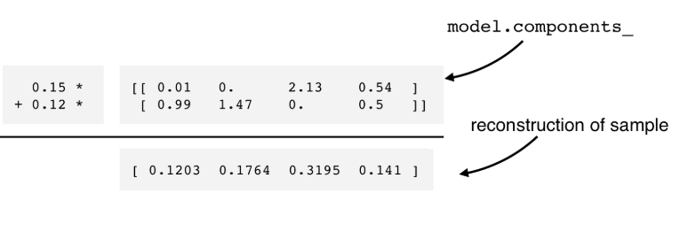

# Unsupervised Learning in Python

## Chapters: 

1. Clustering for Dataset Exploration
eg. Clustering companies using their stock market sprices of distinguishing species by clustering their measurements

2. Visualization with hierarchical clustering and t-SNE
Two Unsupervised Learning techniques for data visualization, hierarchical clustering and t-SNE.

3. Decorrelating your data and dimension reduction

PCA is often used before supervised learning to improve model performance and generalization. It can also be useful for unsupervised learning.

4. Discovering interpretable features

Dimension reduction technique called Non-negative matrix factorization (NMF) that expresses samples as combinations of interpretable parts.

## Chapter 1

Unsupervised learning helps find patterns in data without a specific prediction task in mind, or compress data.
- # features = # dimensions

- k-means Clustering

say k = 3
you pick 3 random points in the data. You assign each data point a cluster based on what its closest to. Now replace all the 33 points with the mean of the points in the cluster. Repeat this process until the cluster centers don't change. Till will not necessary give you the best clustering. Find the variance in each cluster and sum them up. You try with different initial cluster centers, and pick the one with lowest variance.
k means remembers the centroids for each cluster. When you add new samples, pass it to the predict method to get the cluster label.

```Python
from sklearn.cluster import KMeans
model = KMeans(n_clusters=3) # number of clusters to find in your data
model.fit(samples) # np array
labels = model.predict(samples)
```
labels gives an array of cluster labels for each sample.

```Python
import matplotlib.pyplot as pyplot
xs = samples[:,0] # say sepal length
ys = samples[:,2] # say petal length
plt.scatter(xc, ys, c = labels)
```

- Evaluating a clustering
    - Cross tabulation with pandas
    - Inertia measures clustering quality
    - The lower the inertia, the better the clustering

- Cross Tabulation with pandas
```Python
import pandas as pd
df = pd.DataFrame({'labels': labels, 'species': species})
ct = pd.crosstab(df['labels'], df['species'])
print(ct)
```
Most datasets, you won't find a column to compare against. 
Inertia measures cluster quality (how spread out they are,lower the better)
- Tight clusters -> low intertia
- choose an 'elbow' in the inertia vs k plot

`.inertia_` attribute of the model gives the inertia value.

```Python
ks = range(1, 6)
inertias = []

for k in ks:
    # Create a KMeans instance with k clusters: model
    model = KMeans(n_clusters = k)
    
    # Fit model to samples
    model.fit(samples)
    
    # Append the inertia to the list of inertias
    inertias.append(model.inertia_)
    
# Plot ks vs inertias
plt.plot(ks, inertias, '-o')
plt.xlabel('number of clusters, k')
plt.ylabel('inertia')
plt.xticks(ks)
plt.show()
```

### Transforming features for better clustering

- feature variance = feature influence
- StandardScaler standardizes the feature variance

```Python
# Perform the necessary imports
from sklearn.cluster import KMeans
from sklearn.preprocessing import StandardScaler
from sklearn.pipeline import make_pipeline

# Create scaler: scaler
scaler = StandardScaler()

# Create KMeans instance: kmeans
kmeans = KMeans(n_clusters = 4)

# Create pipeline: pipeline
pipeline = make_pipeline(scaler, kmeans)
```

## Ch 2

### Hierarchical (agglomerative) clustering

Associated with heat maps.

- Dendrogram
    - Read from bottom to top
    - Height of the merge = distance between clusters
    - Height of the horizontal line = distance at which clusters merge

- makes a difference if you choose euclidean or manhattan etc. distance metric

```Python
from scipy.cluster.hierarchy import linkage, dendrogram
import matplotlib.pyplot as plt

mergings = linkage(samples, method='complete') # method = 'single' or 'complete'
dendrogram(mergings, labels = country_names, leaf_rotation=90, leaf_font_size=6)
plt.show()
```

Dendrograms show cluster distances.
The height on dendrogram specifies max distance between merging clusters.

Linkage method defines the distance between clusters
Different linkage methods give different hierarchical clustering.

`from scipy.cluster.hierarchy import fcluster` can be used to extract cluster labels.

the linkage method defines how the distance between clusters is measured. In complete linkage, the distance between clusters is the distance between the furthest points of the clusters. In single linkage, the distance between clusters is the distance between the closest points of the clusters.

```Python
# Perform the necessary imports
import matplotlib.pyplot as plt
from scipy.cluster.hierarchy import linkage, dendrogram

# Calculate the linkage: mergings
mergings = linkage(samples, method = 'single')

# Plot the dendrogram
dendrogram(mergings, labels = country_names, leaf_rotation = 90, leaf_font_size = 6)
plt.show()

# Perform the necessary imports
import pandas as pd
from scipy.cluster.hierarchy import fcluster

# Use fcluster to extract labels: labels
labels = fcluster(mergings,6, criterion = 'distance', )

# Create a DataFrame with labels and varieties as columns: df
df = pd.DataFrame({'labels': labels, 'varieties': varieties})

# Create crosstab: ct
ct = pd.crosstab(df['labels'], df['varieties'])
# Display ct
print(ct)
```

### t-SNE for 2D maps

- t-SNE = t-distributed stochastic neighbor embedding
- maps samples from higher to a 2d or 3d space
- some distortion is inevitable
- great for inspecting datasets

eg. iris samples are in a 4d space, t-SNE maps samples to 2D space, and puts then in three clusters even without being told there are three varieties of iris.
We notice setosa is well separated, but versicolor and virginica are overlapping and closer, as observed clustering with two clusters also have low inertia.

```Python
from sklearn.manifold import TSNE
model = TSNE(learning_rate = 100)
transformed = model.fit_transorm(samples)
xs = transformed[:,0]
ys = transformed[:,1]
plt.scatter(xs, ys, c = species)
plt.show()
```

t-SNE only has a `fit-transform` method, it doesn't have a `fit` or `transform`, so you can't extend it with new samples, you have to start from scratch.

- t-SNE learning rate: choose learning rate for the dataset, try values between 50 and 200.
- axes have no interprettable meaning
- you know the learning rate is bad if the points are all bunched up together.

## Ch3 Deocrrelating your data and dimension reduction

PCA alights the data with axes, resulting features are not linearly correlated.
Linear correlation can be measured using Pearson correlation.

It learns the principle components of the data, directions where the data varies the most.
`print(mode.component_)` gives the principal components.

```Python

# Perform the necessary imports
from scipy.stats import pearsonr
import matplotlib.pyplot as plt 

# Assign the 0th column of grains: width
width = grains[:,0]

# Assign the 1st column of grains: length
length = grains[:,1]

# Scatter plot width vs length
plt.scatter(width, length)
plt.axis('equal')
plt.show()

# Calculate the Pearson correlation
correlation, pvalue = pearsonr(width, length)

# Display the correlation
print(correlation)

# Import PCA
from sklearn.decomposition import PCA

# Create PCA instance: model
model = PCA()

# Apply the fit_transform method of model to grains: pca_features
pca_features = model.fit_transform(grains)

# Assign 0th column of pca_features: xs
xs = pca_features[:,0]

# Assign 1st column of pca_features: ys
ys = pca_features[:,1]

# Scatter plot xs vs ys
plt.scatter(xs, ys)
plt.axis('equal')
plt.show()

# Calculate the Pearson correlation of xs and ys
correlation, pvalue = pearsonr(xs, ys)

# Display the correlation
print(correlation)
```

### Intrinsic Dimension

- Intrinsic dimension = number of features needed to approximate the dataset
- can be detected with PCA

consider Versicolor dataset
- take only 3 features, but when you make a 3d scatter plot, it lies on a 2d plane. Means it has intrinsic dimension 2.

- how to identify for multiple features?
    - count the pca features with high variance

```Python
features = range(pca.n_components_)
plt.bar(features, pca.explained_variance_)
plt.xlabel('PCA feature')
plt.ylabel('variance')
plt.xticks(features)
plt.show()
```

specify `n_components` in PCA to specify the number of features you want to keep.

Word frequency array: 
- rows represent documents, columns represent words
- entries represent the frequency of the word in the document
- measure using tf-idf (term frequency-inverse document frequency)
- sparse array, most entries zero, use `scipy.sparse.csr_matrix` instead of a numpy array, sklearn pca can't be used, use `TruncatedSVD`


```Python
# Import TfidfVectorizer
from sklearn.feature_extraction.text import TfidfVectorizer

# Create a TfidfVectorizer: tfidf
tfidf = TfidfVectorizer()

# Apply fit_transform to document: csr_mat
csr_mat = tfidf.fit_transform(documents)

# Print result of toarray() method
print(csr_mat.toarray())

# Get the words: words
words = tfidf.get_feature_names()

# Print words
print(words)

# Perform the necessary imports
from sklearn.decomposition import TruncatedSVD
from sklearn.cluster import KMeans
from sklearn.pipeline import make_pipeline

# Create a TruncatedSVD instance: svd
svd = TruncatedSVD(n_components = 50)

# Create a KMeans instance: kmeans
kmeans = KMeans(n_clusters = 6)

# Create a pipeline: pipeline
pipeline = make_pipeline(svd, kmeans)

# Import pandas
import pandas as pd
# Fit the pipeline to articles
pipeline.fit(articles)
# Calculate the cluster labels: labels
labels = pipeline.predict(articles)

# Create a DataFrame aligning labels and titles: df
df = pd.DataFrame({'label': labels, 'article': titles})

# Display df sorted by cluster label
print(df.sort_values(by = 'label'))

```

## Chapter 4 Discovering interpretable features

### NMF (Non-negative matrix factorization)

It is alsoa a dimensionality reduction technique, but unlike PCA it NMF models are interprettable and easy to explain.

It requires sample features be non-negative.

It decomoposes samples as a combinatino of their parts.


tfidf
tf -> frequency of word in a document
idf -> weighting scheme that reduces influence of common words like 'the'

```Python
from sklearn.decomposition import NMF
model = NMF(n_components = 2)
model.fit(samples)
nmf_features = model.transform(samples)

model.__components_ # gives the components of the model
print(nmf_features) # non negative as well, # columns = # new components
```



- multiply components by feature values and add up for nmf_reconstruction
- can also be expressed as a product of matrices


- if applied to images, components are frequently occurings parts of images.

- Grayscale images can be flattened.

```Python
bimap =  sample.reshape((2,3))
```

### Building recommender systems using NMF

```Python
from sklearn.decomposition import NMF
nmf = NMF(n_components = 6)
nmf_features = nmf.fit_transform(articles)
# compare using cosine similarity, higher the value, more similar the articles
current_article = norm_features[23,:]
similarities = norm_features.dot(current_article)

import pandas as pd
norm_features = normalize(nmf_features)
df = pd.DataFrame(norm_features, index = titles)
current_article = df.loc['Dog bites man']
similarities = df.dot(current_article)

print(similarities.nlargest())
```

```Python
# Perform the necessary imports
import pandas as pd
from sklearn.preprocessing import normalize

# Normalize the NMF features: norm_features
norm_features = normalize(nmf_features)

# Create a DataFrame: df
df = pd.DataFrame(norm_features, index = titles)

# Select the row corresponding to 'Cristiano Ronaldo': article
article = df.loc['Cristiano Ronaldo']

# Compute the dot products: similarities
similarities = df.dot(article)

# Display those with the largest cosine similarity
print(similarities.nlargest())
```

```Python
# Perform the necessary imports
from sklearn.decomposition import NMF
from sklearn.preprocessing import Normalizer, MaxAbsScaler
from sklearn.pipeline import make_pipeline

# Create a MaxAbsScaler: scaler
scaler = MaxAbsScaler()

# Create an NMF model: nmf
nmf = NMF(n_components = 20)

# Create a Normalizer: normalizer
normalizer = Normalizer()

# Create a pipeline: pipeline
pipeline = make_pipeline(scaler, nmf, normalizer)
# Apply fit_transform to artists: norm_features
norm_features = pipeline.fit_transform(artists)
```
```Python
# Import pandas
import pandas as pd

# Create a DataFrame: df
df = pd.DataFrame(norm_features, index = artist_names)

# Select row of 'Bruce Springsteen': artist
artist = df.loc['Bruce Springsteen']

# Compute cosine similarities: similarities
similarities = df.dot(artist)

# Display those with highest cosine similarity
similarities.nlargest()
```
